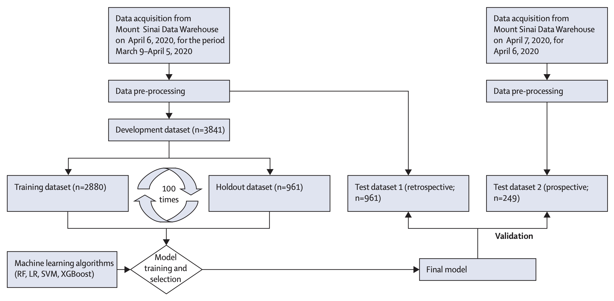

<a href='https://www.thelancet.com/journals/landig/article/PIIS2589-7500(20)30217-X/fulltext'>Download paper here</a>

[GitHub Repository](https://github.com/SBCNY/Clinical-predictors-of-COVID-19-mortality){:target=&quot;_blank&quot;}, [Article on Medical Xpress](https://medicalxpress.com/news/2020-09-covid-mortality.html){:target=&quot;_blank&quot;}

Recommended citation: Clinical features of COVID-19 mortality: development and validation of a clinical prediction model. Yadaw, Arjun S; Li, Yan-chak; Bose, Sonali; Iyengar, Ravi; Bunyavanich, Supinda; Pandey, Gaurav. The Lancet Digital Health. 2020. 2(10).