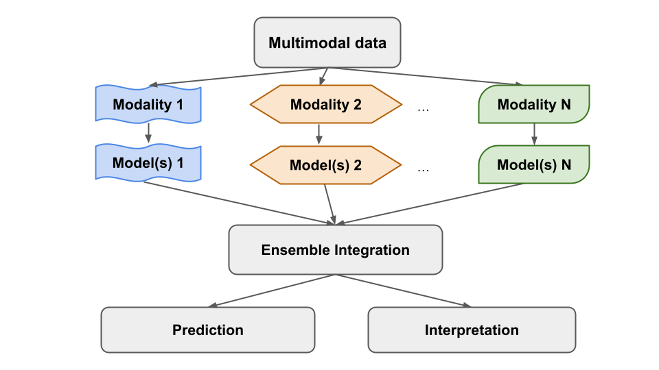

<a href='https://www.biorxiv.org/content/10.1101/2020.05.29.123497v2'>Download paper here</a>

[GitHub Repository](https://github.com/GauravPandeyLab/ensemble_integration)

Recommended citation: Integrating multimodal data through interpretable heterogeneous ensembles, Li, Yan-Chak; Wang, Linhua; Law, Jeffrey; Murali, TM; Pandey, Gaurav. bioRxiv. 2022